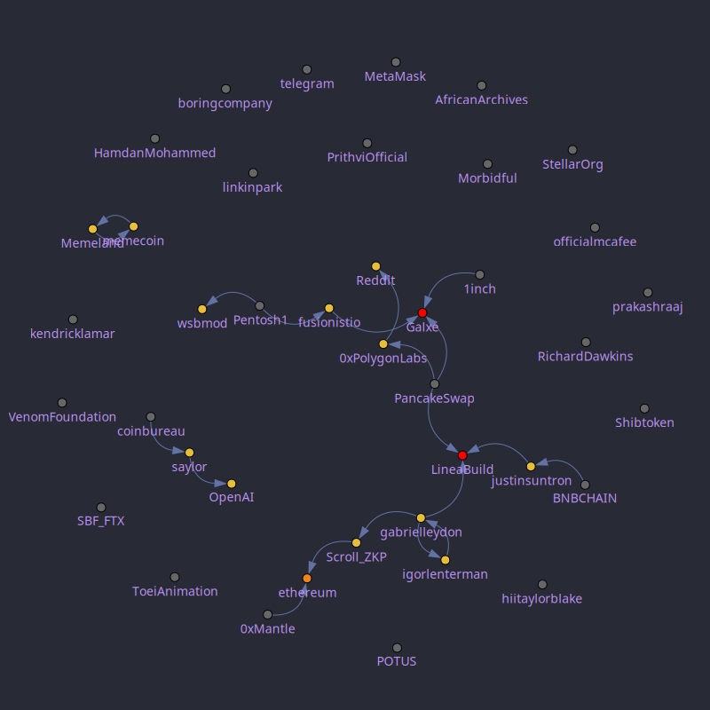
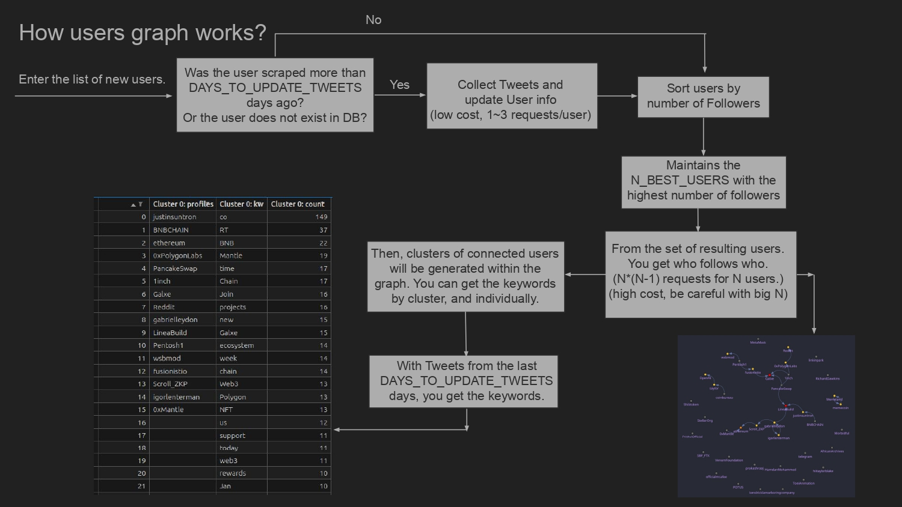
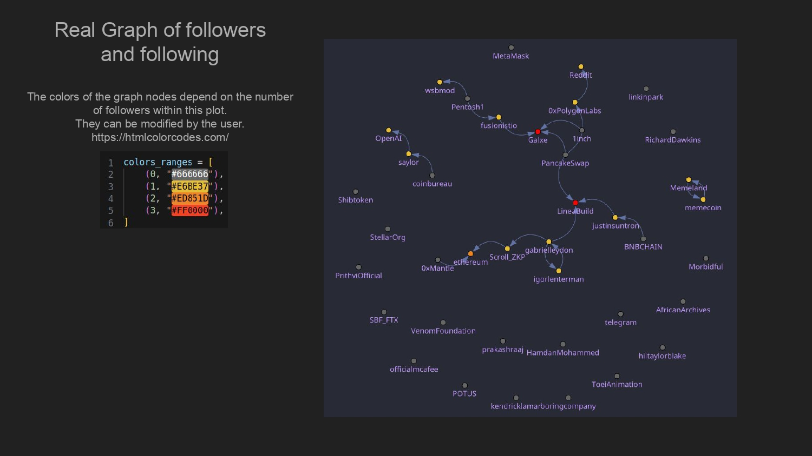
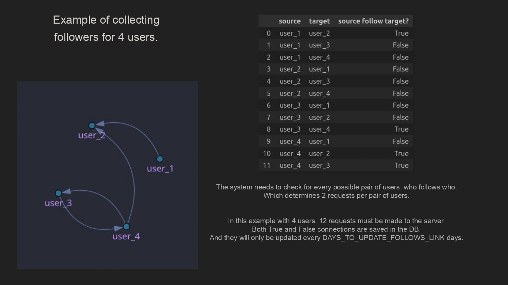
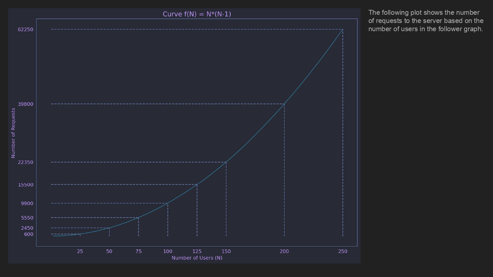

# Scripts
- `0_run_server.ipynb`: Run MongoDB local server.
- `0_backup_db.ipynb`: Save backup on MongoDB into `data/`.
- `1_collect_trends_today.ipynb`: Collect Trends from today.
- `2_collect_topics_trends.ipynb`: Collect Topics from Trends into DB using AI.
- `3_collect_topics_users.ipynb`: Collect Topics from Users selected into DB using AI.
- `A_collect_graph_users.ipynb`: Collect all information and update from Users, and Links Betweenness, keywords, and build Graph of Followers and Following.
- `B_trends_accumulated.ipynb`: Search Trends into DB accumulated in date range.
- `C_trends_per_day.ipynb`: Search Trends into DB in a single day.


# Quickstart
##### Setup Python Enviroment
```bash
cd path/to/project
python3 -m venv env
source env/bin/activate
pip install -r requirements.txt
```


##### Configure VSCode
- Go to the Extensions section in VSCode.
- Install the Python extension.
- Install Jupyter Notebook extension.


##### Credentials
- Create `data/acc.json`.
- The credentials provided by RapidAPI must be included inside.
- Notes: Do not use the `headers` functions directly, nor print their values for password security.
```python
# Inside `data/acc.json`
[
    {"acc_name": "bot_1", "credential": "rapidapi_credential_1"},
    {"acc_name": "bot_2", "credential": "rapidapi_credential_2"},
    ...
]
```


##### Install MongoDB
- Install MongoDB.
```bash
mkdir -p /data/db
```

- Can start MongoDB with:
```bash
mongod --dbpath /data/db
# Or execute `0_run_server.ipynb`.
```


# Fancy Plots
- Example for a `list of 1000 users` of which `40 were chosen` due to the `greatest number of followers`.





